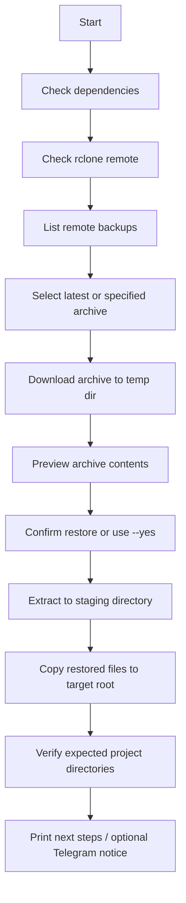

# docker-restore-tool

> Restore Docker project backups from an `rclone` remote onto a fresh server with a Bash-first workflow.

`docker-restore-tool` is a small, auditable restore utility for operators who keep compressed Docker project backups in remote storage and want a repeatable recovery process.

It is built for a practical flow:

- list available backup archives,
- pick the newest archive or specify one manually,
- download it via `rclone`,
- extract into a staging directory,
- copy restored files into a target root such as `/opt`,
- verify that expected project directories exist.

---

## Highlights

- **Works with any `rclone` remote**
- **Dry-run support** before touching the filesystem
- **Non-interactive mode** with `--yes`
- **Config file support** via `.env.example`
- **Optional Telegram notifications**
- **Small Bash codebase** that's easy to review and modify

---

## Table of Contents

- [Use Case](#use-case)
- [Requirements](#requirements)
- [Quick Start](#quick-start)
- [Initialize rclone](#initialize-rclone)
- [Run the Script](#run-the-script)
- [Configuration](#configuration)
- [Example Commands](#example-commands)
- [How It Works](#how-it-works)
- [Restore Flow](#restore-flow)
- [Troubleshooting](#troubleshooting)
- [Safety Notes](#safety-notes)
- [Limitations](#limitations)
- [Roadmap](#roadmap)
- [Chinese Documentation](#chinese-documentation)

---

## Use Case

This project is useful when you:

- back up Docker project directories as `.tar.gz` archives,
- store them in an `rclone`-accessible remote,
- need to restore them onto a new VPS or replacement server,
- want something safer and more reusable than a one-off shell command.

Typical examples:

- migrating to a new host,
- rebuilding a self-hosted environment after failure,
- restoring multiple `/opt/<project>` directories in one pass.

---

## Requirements

### Required tools

- `bash`
- `rclone`
- `tar`
- `awk`
- `grep`
- `sed`
- `cut`
- `du`

### Optional but recommended

- `pigz` — faster decompression
- `column` — prettier backup list output
- `curl` — needed only for Telegram notifications

### Install dependencies on Debian / Ubuntu

```bash
sudo apt-get update
sudo apt-get install -y tar pigz bsdextrautils curl
curl https://rclone.org/install.sh | sudo bash
```

---

## Quick Start

### 1) Clone the repository

```bash
git clone https://github.com/lbjxr/docker-restore-tool.git
cd docker-restore-tool
chmod +x docker_restore.sh
```

### 2) Configure `rclone`

```bash
rclone config
```

If your backup remote is already configured, you can verify it with:

```bash
rclone listremotes
rclone ls infini:Backup/RN/Docker
```

### 3) Create your local config file

```bash
cp .env.example .env
```

Edit `.env` and adjust values if needed.

### 4) Run a dry run first

```bash
bash docker_restore.sh --config .env --dry-run
```

### 5) Run a real restore

```bash
bash docker_restore.sh --config .env --yes
```

---

## Initialize rclone

If you have never used `rclone` on the server before, initialize it first:

```bash
rclone config
```

Typical flow:

1. Choose `n` for **New remote**
2. Enter a name, for example:
   - `infini`
3. Select your storage type
4. Fill in the endpoint / credentials required by your provider
5. Save the configuration

Then verify that the remote works:

```bash
rclone listremotes
rclone ls infini:Backup/RN/Docker
```

If `rclone ls` works, the script should be able to read the backup list too.

### Example: InfiniCloud via WebDAV

If your backup storage is InfiniCloud WebDAV, a typical `rclone config` flow looks like this:

```text
n) New remote
name> infini
Storage> webdav
url> https://infini-cloud.net/dav
vendor> other
user> <your-username>
password> <your-password>
bearer_token> 
y) Yes this is OK
q) Quit config
```

After that, test it again:

```bash
rclone ls infini:Backup/RN/Docker
```

---

## Run the Script

### Basic usage

```bash
bash docker_restore.sh [backup-file] [options]
```

### Show help

```bash
bash docker_restore.sh --help
```

### Restore the latest backup

```bash
bash docker_restore.sh --config .env --yes
```

### Restore a specific archive

```bash
bash docker_restore.sh DockerBackup_2026-04-05_160000.tar.gz --config .env --yes
```

### Preview without changing anything

```bash
bash docker_restore.sh --config .env --dry-run
```

### Use without a config file

```bash
bash docker_restore.sh \
  --remote infini \
  --remote-dir Backup/RN/Docker \
  --restore-root /opt \
  --yes
```

---

## Configuration

The repository includes an example config file:

- [`.env.example`](./.env.example)

Create your own:

```bash
cp .env.example .env
```

Example contents:

```bash
REMOTE_NAME=infini
REMOTE_DIR=Backup/RN/Docker
RESTORE_ROOT=/opt
TEMP_DIR=/tmp/docker_restore_work
LOG_FILE=/tmp/docker_restore.log
TELEGRAM_BOT_TOKEN=
TELEGRAM_CHAT_ID=
```

### Supported variables

- `REMOTE_NAME` — rclone remote name
- `REMOTE_DIR` — remote backup directory
- `RESTORE_ROOT` — restore target root directory
- `TEMP_DIR` — temporary work directory
- `LOG_FILE` — log file path
- `TELEGRAM_BOT_TOKEN` — optional notification token
- `TELEGRAM_CHAT_ID` — optional Telegram chat id

---

## Example Commands

### Restore latest archive from the default remote

```bash
bash docker_restore.sh --config .env --yes
```

### Restore a specific archive

```bash
bash docker_restore.sh DockerBackup_2026-04-05_160000.tar.gz --config .env --yes
```

### Use a custom restore root

```bash
bash docker_restore.sh --config .env --restore-root /srv/apps --yes
```

### Verify only selected projects

```bash
bash docker_restore.sh --config .env --projects NginxProxyManager,openlist,komari --yes
```

### Disable Telegram notifications

```bash
bash docker_restore.sh --config .env --yes --no-telegram
```

---

## Command Options

| Option | Description |
|---|---|
| `-c, --config <file>` | Load environment variables from a config file |
| `--remote <name>` | rclone remote name |
| `--remote-dir <path>` | rclone remote directory |
| `--restore-root <path>` | final destination root |
| `--temp-dir <path>` | temporary working directory |
| `--log-file <path>` | log file path |
| `--projects <csv>` | comma-separated project names used in verification |
| `-y, --yes` | skip interactive confirmation |
| `--dry-run` | preview actions without modifying files |
| `--no-telegram` | disable Telegram notifications |
| `-h, --help` | show help |

---

## How It Works

1. Validate required tools
2. Validate that the `rclone` remote exists
3. List available backup archives in the remote directory
4. Select the latest archive or use the provided filename
5. Download the archive into a temporary directory
6. Preview archive contents
7. Extract into a staging directory
8. Copy the staged restore root into the final destination
9. Verify expected project directories
10. Print suggested post-restore actions

---

## Restore Flow



---

## Troubleshooting

### `rclone remote not found`

Cause:
- The remote name in `.env` or `--remote` does not exist on the machine.

Check:

```bash
rclone listremotes
```

Fix:
- Create the remote with `rclone config`
- Or update `REMOTE_NAME` / `--remote` to the correct value

### `No backup files found`

Cause:
- The remote directory is wrong
- The archive naming pattern does not match
- The remote is reachable, but the directory is empty

Check:

```bash
rclone ls infini:Backup/RN/Docker
```

Fix:
- Verify `REMOTE_DIR`
- Confirm your backups are stored under the expected path
- Confirm archive names still contain `DockerBackup_`

### `Expected extracted directory not found`

Cause:
- The archive layout does not match `--restore-root`

Example:
- If `--restore-root /opt` is used, the archive is expected to contain paths under `opt/...`

Check:

```bash
tar -tzf your-backup.tar.gz | head -50
```

Fix:
- Adjust `--restore-root`
- Or rebuild the archive with the expected directory structure

### Restore completed but some projects show `not found`

Cause:
- The verification list does not match the actual project names
- The backup does not contain all expected projects

Fix:
- Pass a custom list with `--projects`
- Or edit the config / defaults to match your actual restore set

### Permission denied when restoring into `/opt`

Cause:
- The current user cannot write to the target directory

Fix:
- Run with a user that has permission
- Or restore into another writable directory first

---

## Safety Notes

This tool is intentionally powerful. Read this before using it on production hosts.

### Risks

- It restores real files into a target directory such as `/opt`
- Existing files may be overwritten
- It assumes the archive layout matches your chosen `--restore-root`
- Telegram notifications send execution results to an external service
- It trusts the operator’s `rclone` configuration and remote contents

### Recommended Practice

- Always run `--dry-run` first
- Test on a disposable VM before production use
- Snapshot the host before a real restore
- Review the archive layout with `tar -tzf`
- Never commit live tokens, chat IDs, remote credentials, or private infrastructure details

---

## Limitations

- Verification only checks whether expected directories exist
- It does not validate application health after containers start
- It does not verify checksums or signatures yet
- It currently assumes `tar.gz` archives
- It is aimed at directory-based restores, not logical database restores

---

## Roadmap

Potential next improvements:

- SHA256 checksum validation
- archive manifest support
- project auto-discovery instead of a static project list
- automatic backup of destination directories before overwrite
- structured logging
- post-restore health checks
- optional `rsync`-based copy stage
- CI checks with `shellcheck` and `shfmt`

---

## Project Structure

```text
.
├── .env.example
├── .gitignore
├── LICENSE
├── README.md
├── README.zh-CN.md
└── docker_restore.sh
```

---

## Chinese Documentation

For a Chinese version of this README, see:

- [README.zh-CN.md](./README.zh-CN.md)

---

## License

MIT
