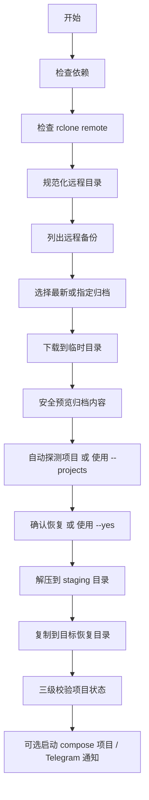

# docker-restore-tool

> 一个基于 Bash 的 Docker 项目备份恢复工具，用于把 `rclone` 远程存储中的归档恢复到新服务器。

`docker-restore-tool` 适合这样的场景：

- 你把 Docker 项目目录打包成归档备份；
- 这些备份放在 `rclone` 可以访问的远程存储里；
- 你需要在新 VPS 或替换服务器上，按固定步骤完成恢复；
- 你希望这不是一次性的“救火命令”，而是一个可复用的小工具。

它的核心流程很直接：

- 列出远程备份
- 自动选最新或手动指定归档
- 用 `rclone` 下载
- 安全预览归档内容
- 先解压到 staging 目录
- 再复制到目标目录（如 `/opt`）
- 最后按项目列表做恢复校验，并区分是否可直接启动

---

## 亮点

- **支持任意 `rclone` remote`**
- **支持 `--dry-run` 预演**
- **支持 `--yes` 非交互执行**
- **支持 `.env.example` 配置文件方式**
- **支持可选 Telegram 通知，回执更完整**
- **支持 `--start-services` 自动启动可启动项目**
- **默认从归档自动探测 `RESTORE_ROOT/*` 顶层项目用于校验**
- **Bash 脚本很小，便于审计和修改**

---

## 目录

- [适用场景](#适用场景)
- [依赖要求](#依赖要求)
- [快速开始](#快速开始)
- [初始化 rclone](#初始化-rclone)
- [脚本运行方式](#脚本运行方式)
- [配置文件](#配置文件)
- [示例命令](#示例命令)
- [工作流程](#工作流程)
- [恢复流程图](#恢复流程图)
- [常见问题排查](#常见问题排查)
- [安全提醒](#安全提醒)
- [当前限制](#当前限制)
- [后续路线图](#后续路线图)

---

## 适用场景

这个项目适合你在以下情况下使用：

- 把 Docker 项目目录保存为 `.tar.gz` 备份；
- 用 `rclone` 管理远程备份存储；
- 需要把多个 `/opt/<project>` 项目恢复到一台新机器；
- 想要一套可重复、可审阅、比临时命令更稳的恢复流程。

常见用法包括：

- 迁移到新主机
- 故障后重建自托管环境
- 一次性恢复多个项目目录

---

## 依赖要求

### 必需工具

- `bash`
- `rclone`
- `tar`
- `awk`
- `grep`
- `sed`
- `cut`
- `du`
- `cp`

### 推荐但非必需

- `pigz` —— 更快的解压速度
- `column` —— 让备份列表输出更好看
- `curl` —— 只有在启用 Telegram 通知时才需要
- `docker` / `docker compose` —— 只有启用 `--start-services` 时才需要

### Debian / Ubuntu 安装方式

```bash
sudo apt-get update
sudo apt-get install -y tar pigz bsdextrautils curl
curl https://rclone.org/install.sh | sudo bash
```

---

## 快速开始

### 1）克隆仓库

```bash
git clone https://github.com/lbjxr/docker-restore-tool.git
cd docker-restore-tool
chmod +x docker_restore.sh
```

### 2）配置 `rclone`

```bash
rclone config
```

如果你已经配过 remote，可以直接检查：

```bash
rclone listremotes
rclone ls infini:Backup/RN/Docker
```

### 3）创建本地配置文件

```bash
cp .env.example .env
```

然后按你的实际情况编辑 `.env`。

### 4）先做一次预演

```bash
bash docker_restore.sh --config .env --dry-run
```

### 5）再执行真实恢复

```bash
bash docker_restore.sh --config .env --yes
```

### 6）需要的话，恢复后自动启动服务

```bash
bash docker_restore.sh --config .env --yes --start-services
```

---

## 初始化 rclone

如果这台机器还没用过 `rclone`，先初始化：

```bash
rclone config
```

常见流程：

1. 选择 `n` 创建 **New remote**
2. 输入一个 remote 名称，例如：
   - `infini`
3. 选择你的存储类型
4. 填写对应的 endpoint / 账号 / 密码 / token 等信息
5. 保存配置

然后验证 remote 是否可用：

```bash
rclone listremotes
rclone ls infini:Backup/RN/Docker
```

只要 `rclone ls` 能成功，脚本通常就能正常读取备份列表。

### InfiniCloud WebDAV 示例

如果你用的是 InfiniCloud WebDAV，`rclone config` 的典型流程大致如下：

```text
n) New remote
name> infini
Storage> webdav
url> https://infini-cloud.net/dav
vendor> other
user> <你的用户名>
password> <你的密码>
bearer_token> 
y) Yes this is OK
q) Quit config
```

然后再次验证：

```bash
rclone ls infini:Backup/RN/Docker
```

---

## 脚本运行方式

### 基本用法

```bash
bash docker_restore.sh [backup-file] [options]
```

### 查看帮助

```bash
bash docker_restore.sh --help
```

### 恢复最新备份

```bash
bash docker_restore.sh --config .env --yes
```

### 恢复指定归档

```bash
bash docker_restore.sh DockerBackup_2026-04-05_160000.tar.gz --config .env --yes
```

### 恢复后自动启动存在 compose 文件的项目

```bash
bash docker_restore.sh --config .env --yes --start-services
```

### 只预览，不实际改动文件

```bash
bash docker_restore.sh --config .env --dry-run
```

### 不用配置文件，直接传参数运行

```bash
bash docker_restore.sh \
  --remote infini \
  --remote-dir Backup/RN/Docker \
  --restore-root /opt \
  --yes
```

---

## 配置文件

仓库自带一个示例配置文件：

- [`.env.example`](./.env.example)

创建自己的配置：

```bash
cp .env.example .env
```

示例内容：

```bash
REMOTE_NAME=infini
REMOTE_DIR=Backup/RN/Docker
RESTORE_ROOT=/opt
TEMP_DIR=/tmp/docker_restore_work
LOG_FILE=/tmp/docker_restore.log
TELEGRAM_BOT_TOKEN=
TELEGRAM_CHAT_ID=
```

### 支持的变量

- `REMOTE_NAME` —— rclone remote 名称
- `REMOTE_DIR` —— 远程备份目录
- `RESTORE_ROOT` —— 最终恢复目录根路径
- `TEMP_DIR` —— 临时工作目录
- `LOG_FILE` —— 日志文件路径
- `TELEGRAM_BOT_TOKEN` —— 可选，Telegram 通知 token
- `TELEGRAM_CHAT_ID` —— 可选，Telegram 通知 chat id

---

## 示例命令

### 恢复默认 remote 中最新归档

```bash
bash docker_restore.sh --config .env --yes
```

### 恢复指定归档

```bash
bash docker_restore.sh DockerBackup_2026-04-05_160000.tar.gz --config .env --yes
```

### 指定不同恢复目录

```bash
bash docker_restore.sh --config .env --restore-root /srv/apps --yes
```

### 只校验部分项目

```bash
bash docker_restore.sh --config .env --projects NginxProxyManager,openlist,komari --yes
```

> 如果不传 `--projects`，脚本会默认从归档中自动探测 `RESTORE_ROOT` 下的顶层目录作为校验目标，而不是使用写死列表。

### 恢复后自动启动 compose 项目

```bash
bash docker_restore.sh --config .env --yes --start-services
```

### 禁用 Telegram 通知

```bash
bash docker_restore.sh --config .env --yes --no-telegram
```

---

## 命令参数

| 参数 | 说明 |
|---|---|
| `-c, --config <file>` | 从配置文件加载环境变量 |
| `--remote <name>` | rclone remote 名称 |
| `--remote-dir <path>` | 远程备份目录；会自动规范化，避免双斜杠 |
| `--restore-root <path>` | 最终恢复目录根路径 |
| `--temp-dir <path>` | 临时工作目录 |
| `--log-file <path>` | 日志文件路径 |
| `--projects <csv>` | 用逗号分隔的项目列表，用于恢复校验；不传则从归档自动探测 |
| `--start-services` | 恢复后对存在 compose 文件的项目执行 `docker compose up -d` |
| `-y, --yes` | 跳过交互确认 |
| `--dry-run` | 预演，不修改文件 |
| `--no-telegram` | 禁用 Telegram 通知 |
| `-h, --help` | 显示帮助 |

---

## 工作流程

1. 检查依赖工具是否存在
2. 检查 `rclone` remote 是否存在
3. 规范化 `REMOTE_DIR`，避免拼接出双斜杠
4. 列出远程目录中的备份归档
5. 自动选择最新备份或使用指定文件
6. 下载到临时目录
7. 安全预览归档内容，不会因为预览消耗归档流而影响恢复
8. 若未传 `--projects`，自动从归档探测 `RESTORE_ROOT` 下的顶层项目目录
9. 解压到 staging 目录
10. 将 staging 中对应路径复制到最终目录
11. 校验结果分为三类：已恢复且可启动、已恢复但无 compose、未恢复
12. 可选启动可启动项目，并输出恢复后的后续动作建议
13. 可选发送 Telegram 回执，包含备份名、恢复目录、项目摘要、可启动项目数、结果性质与 exit code

---

## 恢复流程图



---

## 常见问题排查

### `rclone remote not found`

原因：
- `.env` 或 `--remote` 里的 remote 名称在当前机器上不存在

检查：

```bash
rclone listremotes
```

修复：
- 用 `rclone config` 创建 remote
- 或修正 `REMOTE_NAME` / `--remote`

### `No backup files found`

原因：
- 远程目录写错了
- 归档命名规则不匹配
- remote 能访问，但目录为空

检查：

```bash
rclone ls infini:Backup/RN/Docker
```

修复：
- 检查 `REMOTE_DIR`
- 确认备份确实在目标路径下
- 确认归档名称仍包含 `DockerBackup_`

### `Expected extracted directory not found`

原因：
- 归档内部结构和 `--restore-root` 不匹配

例如：
- 如果使用 `--restore-root /opt`，那么归档里应包含 `opt/...` 这样的路径

检查：

```bash
tar -tzf your-backup.tar.gz | head -50
```

修复：
- 调整 `--restore-root`
- 或重新打包归档，使目录结构符合预期

### 恢复完成但部分项目显示 `not found`

原因：
- 你通过 `--projects` 指定的项目与实际项目名不一致
- 自动探测到的项目在最终恢复目录下不存在
- 备份本身不包含全部预期项目

修复：
- 用 `--projects` 传入明确的自定义项目列表
- 先用 `tar -tzf` 检查归档里 `opt/` 下到底有哪些顶层目录
- 确认 `--restore-root` 与归档内部路径一致

### 项目显示已恢复但不可启动

原因：
- 项目目录存在，但没有 `docker-compose.yml` / `docker-compose.yaml` / `compose.yml` / `compose.yaml`
- compose 文件名或位置不符合脚本默认检查规则

修复：
- 手动检查项目目录结构
- 修正 compose 文件位置或名称
- 若项目本就不依赖 compose，可以忽略该状态

### 恢复到 `/opt` 时出现 Permission denied

原因：
- 当前用户没有写入目标目录的权限

修复：
- 用有权限的用户执行
- 或先恢复到其他可写目录再处理

---

## 安全提醒

这是一个强操作脚本，方便，但也有明确风险。

### 风险点

- 会向目标目录（如 `/opt`）恢复真实文件
- 可能覆盖现有文件
- 默认假设归档结构与你的 `--restore-root` 一致
- `--start-services` 会直接启动恢复后的 compose 项目
- 启用 Telegram 时会把执行结果发到外部服务
- 默认信任本机 `rclone` 配置和远端备份内容

### 建议实践

- 永远先跑 `--dry-run`
- 先在测试机验证
- 正式恢复前先做系统快照或额外备份
- 先用 `tar -tzf` 看归档结构
- 不要把真实 Token、Chat ID、远程凭据、私有基础设施信息提交到仓库

---

## 当前限制

- 当前校验逻辑只区分目录是否存在、是否含 compose 文件
- 即使启用了 `--start-services`，也不会进一步验证业务健康状态
- 还没有 checksum / 签名校验
- 当前只支持 `tar.gz` 归档
- 更适合目录恢复，不是数据库逻辑恢复工具

---

## 后续路线图

- 增加 SHA256 校验
- 支持归档 manifest
- 恢复前先自动备份目标目录
- 增加结构化日志
- 增加自动启动后的健康检查
- 支持 `rsync` 复制阶段
- 接入 `shellcheck` / `shfmt` 做 CI

---

## 项目结构

```text
.
├── .env.example
├── .gitignore
├── LICENSE
├── README.md
├── README.zh-CN.md
└── docker_restore.sh
```

---

## License

MIT
